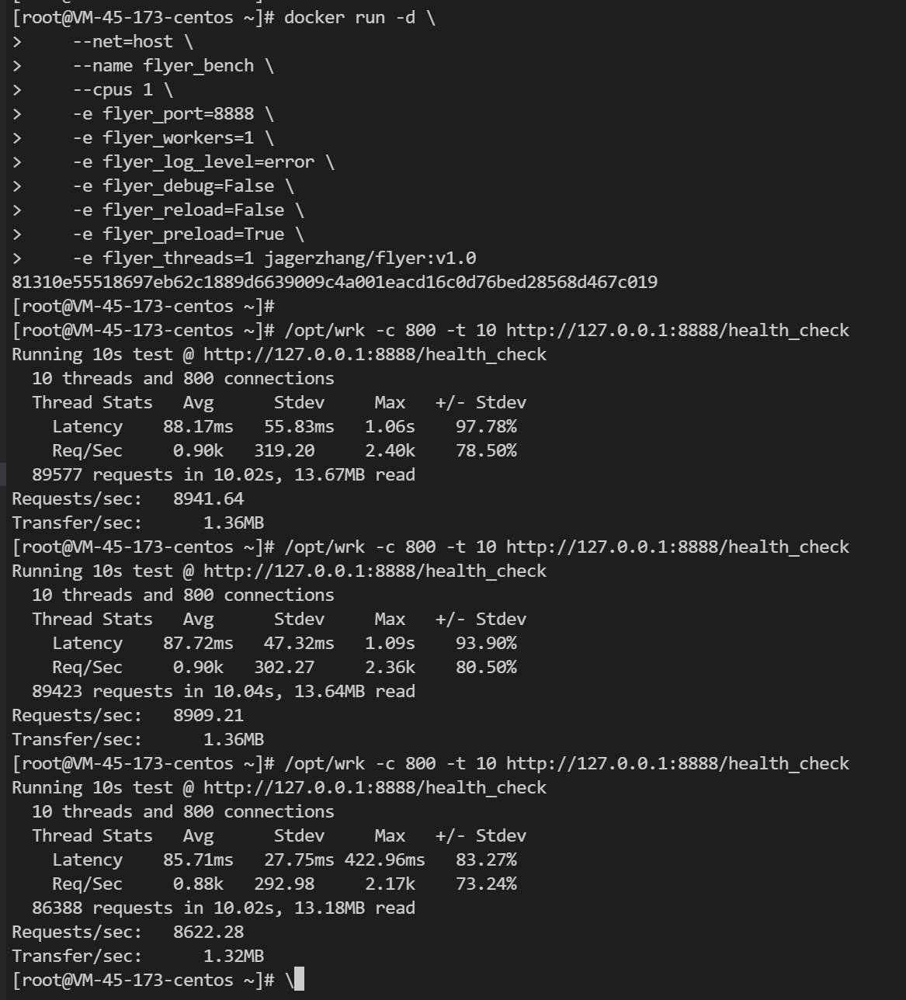

## Flyer: 轻量级 API 开发框架

## 项目介绍
Flyer 是基于 FastAPI 设计的轻量级 API 开发框架，帮助运维人员快速开发运维业务接口。


## 性能测试
单核单进程模式，Flyer空载性能在8k+QPS，基本可以满足绝大部分运维场景。压测方式如下：

### 启动服务
```
docker run -d \
    --net=host \
    --name flyer_bench1 \
    --cpus 1 \
    -e flyer_port=8888 \
    -e flyer_workers=1 \
    -e flyer_log_level=error \
    -e flyer_debug=0 \
    -e flyer_reload=0 \
    -e flyer_preload=0 \
    -e flyer_access_log=0 \
    -e flyer_threads=1 jagerzhang/flyer:v1.1
```
### 启动压测
```shell
[root@localhost ~]# ./wrk -c 800 -t 10 http://127.0.0.1:8888/flyer/v1/health_check
Running 10s test @ http://127.0.0.1:8888/flyer/v1/health_check
  10 threads and 800 connections
  Thread Stats   Avg      Stdev     Max   +/- Stdev
    Latency    87.78ms   19.46ms 430.79ms   90.17%
    Req/Sec     0.90k   252.02     1.62k    81.85%
  89274 requests in 10.03s, 13.62MB read
Requests/sec:   8901.47
Transfer/sec:      1.36MB
```

### 压测结果


## 快速上手
### 服务依赖
- 运行环境：Python 3.6.8 或更高版本
- 开源组件：MySQL、Redis、Kafka（均为按需启用）

### 基于Docker部署
#### 构建镜像
```shell
git clone https://github.com/jagerzhang/flyer.git
cd flyer
docker build -t "flyer:test" .
```
#### 运行服务
可以通过以下命令快速预览 Flyer 的 Demo 示例。
```shell
docker run \
  --net=host \
  --name=flyer \
  flyer:test ./start-dev.sh
```
成功启动后，浏览器访问下文的[接口文档](#%E6%8E%A5%E5%8F%A3%E6%96%87%E6%A1%A3)中的地址即可查看效果。

## 正式开发
### 容器模式
可以基于上面制作的`flyer:test`容器镜像来快速部署开箱即用的开发环境：
```shell
# 克隆代码
cd /data/
git clone https://github.com/jagerzhang/flyer.git

# 启动容器，将本地代码挂进去
docker run \
--net=host \
--name=flyer_dev \
-v /data/flyer:/flyer \
flyer:test \
./start-dev.sh
```
### 普通模式
#### 安装依赖：
```shell
# 安装Python3和基础组件
yum install -y python3 python3-devel python3-setuptools make snappy-devel gcc-c++

# 安装 Flyer 依赖的 Python 插件
pip3 install --no-cache-dir -r requirements.txt 
```
注：以上为Centos环境的安装步骤，其他系统请参考修改命令即可。

#### 启动服务
```shell
git clone https://github.com/jagerzhang/flyer.git
cd flyer
./start-dev.sh
```
成功启动后，浏览器访问下面的[接口文档](#%E6%8E%A5%E5%8F%A3%E6%96%87%E6%A1%A3)中的地址即可查看效果，修改任何 Python 代码保存都会自动加载。

### 代码结构
以下是框架的代码结构说明，开发时只需要复制一份 demo 文件夹进行逻辑代码编写：
```shell
.
├── api                            # API 汇总目录， 里面按文件夹存放独立的 API 服务
│   ├── base                       # 框架内置 API，主要包括监控检查、swagger 文档、ReDoc 文档
│   ├── demo                       # 内置的 API 样例，用于 API 开发参考 
│   │   ├── __init__.py            # 注册路由
│   │   ├── models                 # API 核心逻辑
│   │   ├── routers                # 定义各接口路由
│   │   ├── schemas                # 定义各接口协议
│   │   └── settings.py            # 当前 API 的自定义配置
│   ├── __init__.py                # 总 API 加载入口
│   └── settings.py                # 全局配置脚本
├── build_base.sh                  # 基础镜像构建脚本
├── build.yaml                     # PreCI 本地代码检查配置
├── docker                         # Docker 启动脚本
├── Dockerfile                     # 服务镜像构建配置
├── Dockerfile_base                # 基础镜像构建配置
├── logs                           # API 日志目录
├── main.py                        # 开发环境启动脚本(被 start-dev.sh 调用)
├── README.md                  
├── requirements.txt               # 框架依赖
├── run.sh                         # 容器服务启动入口脚本
├── start-dev.sh                   # 开发环境启动入口脚本
├── static                         # 静态文件目录
├── tests                          # 单元测试脚本目录
│   ├── __init__.py              
│   ├── start-test.sh              # 手工发起一键测试(非 Pytest 方式)
│   ├── test_base.py               # 内置接口的测试脚本
│   ├── test_demo.py               # demo 接口的测试脚本
│   ├── test_exception_validate.py # 参数验证异常的测试脚本
│   └── test_health.py             # 健康检查接口的测试脚本
└── utils                          # 框架公共方法目录
    ├── common.py                  # 通用方法函数
    ├── data.py                    # Redis、MySQL 连接池
    ├── http_requests.py           # 对外 HTTP 请求公共函数，可以记录日志和异常重试
    ├── ierror.py                  # 接口返回码的定义脚本
    ├── __init__.py
    ├── logger.py                  # 日志初始化
    ├── middleware.py              # 框架中间件逻辑，用于埋点、记录耗时、日志等
```

### 接口文档
Flyer 基于 FastAPI 框架，所以自带了 reDoc 和 SwaggerUI，完全实现代码即文档的开发方式，非常方便。
- ReDoc: `http://<IP>:8080/flyer/v1/redoc`
- SwaggerUI: `http://<IP>:8080/flyer/v1/docs`

注：Url 路径中的 `flyer` 和 `v1` 可以通过环境变量`flyer_base_url`和`flyer_version`来定制。

### 环境变量
Flyer 支持通过环境变量来修改各种配置。
**基础变量**
- `flyer_host`: 接口绑定IP，默认为 0.0.0.0
- `flyer_port`：接口绑定端口，默认为 8080
- `flyer_base_url`：服务地址前缀，默认为 /flyer
- `flyer_version`：服务版本，当前为 v1
- `flyer_reload`：接口热加载，用于开发环境，默认为 1
- `flyer_workers`：工作进程数量，默认为 1
- `flyer_threads`：工作线程数量，默认为 5
- `flyer_worker_connections`：最大客户端并发数量，默认为1000
- `flyer_enable_max_requests`：打开自动重启机制，即请求一定数量后进程自动重启，可以缓解内存泄漏问题
- `flyer_max_requests`：重新启动之前，工作将处理的最大请求数。默认值为0
- `flyer_max_requests_jitter`：要添加到max_requests的最大抖动。抖动将导致每个工作的重启被随机化，这是为了避免所有工作被重启。
- `flyer_timeout`：超过这么多秒后工作将被杀掉，并重新启动。默认为60秒
- `flyer_graceful_timeout`：优雅退出时间，默认为10，收到重启信号后，将等待指定时长才（或强制）退出
- `flyer_keepalive`：在keep-alive连接上等待请求的秒数，默认为5
- `flyer_log_level`：定义日志级别，debug/info/warn/error，默认为 info
- `flyer_access_log`：是否记录请求日志，1/0，默认为 1
- `flyer_access_logfile`：定义请求日志文件的位置，默认为-，即输出到容器标准输出

注：更多gunicorn参数可以通过传参给`/run.sh`来覆盖或追加。

**需要用到`Redis`请添加如下配置：**
- `flyer_redis_host`: Redis 服务IP，默认 localhost
- `flyer_redis_port`: Redis 服务端口，默认 6379
- `flyer_redis_pass`: Redis 服务密码，默认为空
- `flyer_redis_db`: Redis 实例DB，默认为 1

**需要用到`MySQL`请添加如下配置：**
- `flyer_db_host`: MySQL 服务地址
- `flyer_db_port`: MySQL 服务端口
- `flyer_db_user`: MySQL 用户名
- `flyer_db_pass`: MySQL 密码
- `flyer_db_name`: MySQL 数据库名称

**需要用到`Kafka`请添加如下配置：**
- `flyer_kafka_topic`: 指定 kafka 消息队列的 Topic
- `flyer_kafka_servers`: 指定 kafka 消息队列的 服务地址，格式为 x.x.x.x:9092,y.y.y.y:9092

### 单元测试
Flyer 的单元测试用例位于根目录下的 `tests` 目录，已支持 `pytest` 和测试堂，完成接口开发后，建议参考 `tests/test_demo.py` 快速补齐测试用例，提高单侧覆盖率。
#### 测试堂测试
**测试单个用例**
```shell
cd tests
./start-test.sh test_demo.py
```
**测试所有用例**
```shell
cd tests
./start-test.sh
```
#### PyTest测试
```shell
# 安装 pytest 和覆盖率统计插件
pip install pytest coverage
cd tests

# 测试单个用例
pytest test_demo.py

# 测试所有用例
pytest

# 测试所有用例，同时展示测试用例的覆盖率统计
pytest --cov=. tests/
```

## 如何加入
直接联系 Jager，一起协同开发即可！
